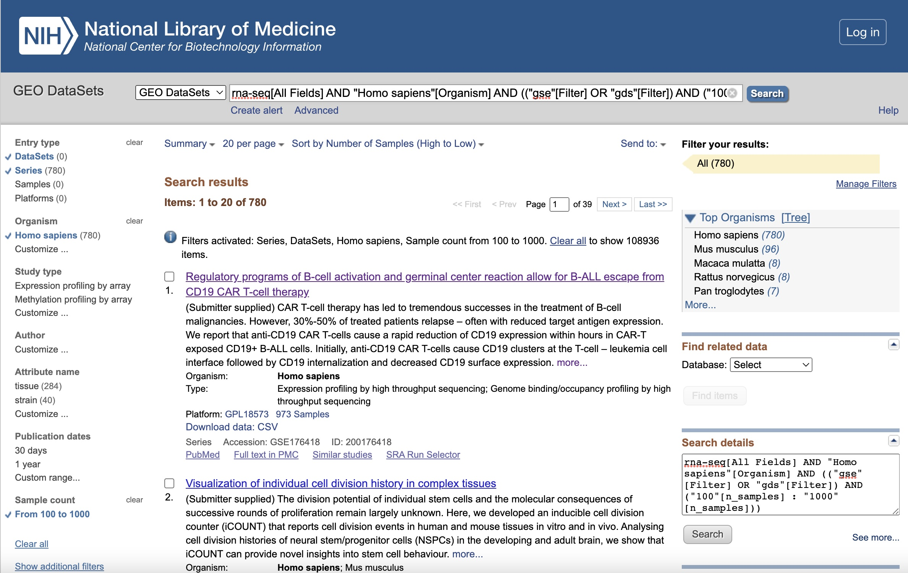

:::::::::::::::::::::::::::::::::::::: questions 

- What format are processed RNA-Seq dataset store on GEO?
- How do I search for a dataset that meets my requirements on GEO?
- How do I use the R package `GEOquery` to download datasets from GEO into R?

::::::::::::::::::::::::::::::::::::::::::::::::

::::::::::::::::::::::::::::::::::::: objectives

- Explain the expected data and file formats for processed RNA-Seq datasets on GEO
- Demonstrate ability to correctly identify the subset of files required to create a dataset for a simple supervised machine learning task (e.g., binary classification)
- Demonstrate ability to download and save processed RNA-Seq data files from GEO suitable for a simple supervised machine learning task (e.g., binary classification)

::::::::::::::::::::::::::::::::::::::::::::::::


## GEO Data Objects

NCBI 'gene expression omnibus' , GEO, one of the largest repositories for functional genomics data. GEO data are stored as individual samples, series of samples and curated datasets. Accession numbers of GEO broadly fall into four categories:

* GSM - GEO Sample. These refer to a single sample.
* GSE - GEO Series. These refer to a list of GEO samples that together form a single experiment.
* GDS - GEO Dataset. These are curated datasets containing summarised information from the underlying GEO samples.

There are many more datasets available as series than there are curated GEO Datasets. For this lesson, we'll focus finding a GEO Series as an illustrative dataset.


## GEO File Formats

Data for RNA-Seq studies have three components on GEO (similar to microarray studies): 

1. **Metadata**

The metadata is equivalent to sample data relationship information provided on ArrayExpress and refers to the descriptive information about the overall study and individual samples, as well as protocol information and references to the raw and processed data files names for each sample. Metadata is typically stored in a number of standard formats on GEO:

* SOFT (Simple Omnibus Format in Text) is a line-based plain text format
* MINiML is an alternative to SOFT and offers an XML rendering of SOFT
* Series Matrix is a summary text files that include a tab delimited value-matrix table

The raw and processed counts data is typically not included in any of the above files for an RNA-Seq experiement (whereas they may be included with a microarray experiment).

2. **Processed data files**

Processed data (raw counts, noramlised counts) are typically provided in a supplementary file, often a gz archieves of text files. Raw and normalised counts may be provided as separate supplementary files.


3. **Raw data files**

Raw data files provide the original reads and quality scores and are stored in the NIH's [Sequence Read Archieve (SRA)](https://www.ncbi.nlm.nih.gov/sra).

Further information on how RNA-Seq experiments are stored on GEO is given in the [submission guidelines](https://www.ncbi.nlm.nih.gov/geo/info/seq.html)


## Searching for a Dataset on GEO

Let's begin on the [GEO home page](https://www.ncbi.nlm.nih.gov/geo/). GEO provides online search and filter tools. We search by adding "rna-seq" as a keyword in the search box, and then apply the following filters to the subsequent results page, and rank the results by the number of samples descending:

<br>

Filter                   | Selection
------------------------ | ---------------------
Keywords.                | "rna-seq"
Entry type               | Series or DataSets
Organism                 | homo sapiens
Sample count             | From 100 to 1,000

<br>

The full search string is:

`rna-seq[All Fields] AND "Homo sapiens"[Organism] AND (("gse"[Filter] OR "gds"[Filter]) AND ("100"[n_samples] : "1000"[n_samples]))`

<br>

The filtered results page should looks like this:

{alt='Screen Shot of GEO DataSets Search Results Tab Filtered'}


## Illustrative Dataset: Covid-19 Dataset

The data set GSE212041 relates to the case-control study of neutrophils in Covid-19+ patients named "Longitudinal characterization of circulating neutrophils uncovers phenotypes associated with severity in hospitalized COVID-19 patients" and comprises longitudinal human samples from  306 hospitalized COVID-19+ patients, 78 symptomatic controls, and 8 healthy controls, each at multiple time points, with a total of 781 samples. We'll call it the [Covid-19 dataset](https://www.ncbi.nlm.nih.gov/geo/query/acc.cgi?acc=GSE212041). Processed data is provided as raw counts and TPM normalised counts in the Supplementary files.

Let's look at some of the basic information on this dataset:

<br>


Data Field              | Values
----------------------- | ---------------------
Sample count            | 781
Experimental Design     | case control design
Experimental factors    | COVID+, COVID- symptomatic, healthy


## Downloading and Reading into R

<br>

### Using GEOquery to download a GEO series as an expression set

The function `getGEO()` from the `GEOquery` library provides a convenient way to download GEO SOFT format data into R. Here we will download the GEO Series GSE212041. This blog provides additional information on [reading GEO SOFT files into R](https://warwick.ac.uk/fac/sci/moac/people/students/peter_cock/r/geo/)
 
If there is more than one SOFT file for a GEO Series, `getGEO()` will return a list of datasets. Let's download GSE212041.


```r
gse212041 <- GEOquery::getGEO("GSE212041")
```

```{.output}
Setting options('download.file.method.GEOquery'='auto')
```

```{.output}
Setting options('GEOquery.inmemory.gpl'=FALSE)
```

```{.output}
Found 2 file(s)
```

```{.output}
GSE212041-GPL18573_series_matrix.txt.gz
```

```{.output}
GSE212041-GPL24676_series_matrix.txt.gz
```


```r
sprintf("Number of files downloaded: %i", length(gse212041))
```

```{.output}
[1] "Number of files downloaded: 2"
```

::::::::::::::::::::::::::::::::::::: challenge 

## Challenge 1: How many samples are in each file?

Write the code to check that the number of samples in each file gives us the total expected number of 781 samples.

:::::::::::::::::::::::: solution 
 

```r
writeLines(sprintf("file %i: %i samples", 1:2, c(dim(gse212041[[1]])[2], dim(gse212041[[2]])[2])))
```

```{.output}
file 1: 16 samples
file 2: 765 samples
```


:::::::::::::::::::::::::::::::::

::::::::::::::::::::::::::::::::::::::::::::::::

<br>

Extract the metadata for the larger dataset and examine the column names to verify that the file contains the expected metadata about the experiment.


```r
samp.info.cov19 <- Biobase::pData(gse212041[[2]])

colnames(samp.info.cov19)
```

```{.output}
 [1] "title"                   "geo_accession"          
 [3] "status"                  "submission_date"        
 [5] "last_update_date"        "type"                   
 [7] "channel_count"           "source_name_ch1"        
 [9] "organism_ch1"            "characteristics_ch1"    
[11] "characteristics_ch1.1"   "characteristics_ch1.2"  
[13] "characteristics_ch1.3"   "characteristics_ch1.4"  
[15] "molecule_ch1"            "extract_protocol_ch1"   
[17] "extract_protocol_ch1.1"  "taxid_ch1"              
[19] "description"             "description.1"          
[21] "data_processing"         "data_processing.1"      
[23] "data_processing.2"       "data_processing.3"      
[25] "data_processing.4"       "platform_id"            
[27] "contact_name"            "contact_email"          
[29] "contact_phone"           "contact_laboratory"     
[31] "contact_institute"       "contact_address"        
[33] "contact_city"            "contact_state"          
[35] "contact_zip/postal_code" "contact_country"        
[37] "data_row_count"          "instrument_model"       
[39] "library_selection"       "library_source"         
[41] "library_strategy"        "supplementary_file_1"   
[43] "acuity.max:ch1"          "cell type:ch1"          
[45] "covid-19 status:ch1"     "patient category:ch1"   
[47] "time point:ch1"         
```

<br>

### Downloading supplementary files

Notice in this series, the counts matrix is not contained in the exprs() slot of the expression set. The expression set only contains a list of the accession numbers of the samples included in the expression set, but not the actual count data. We can verify this by looking at the dimensions of the object in the exprs slot.


```r
dim(Biobase::exprs(gse212041[[2]]))
```

```{.output}
[1]   0 765
```

To get the counts data, we need to download the Supplementary file (not downloaded by the `getGeo()` function). The `GEOquery::getGEOSuppFiles()` function enables us to view and download supplementary files attached to a GEO Series (GSE). This function doesn't parse the downloaded files, since the file format may vary between data series.

Set the 'fetch_files' argument to FALSE initially to view the available files.


```r

GEOquery::getGEOSuppFiles(GEO = "GSE212041",
                          makeDirectory = FALSE,
                          baseDir = "./data",
                          fetch_files = FALSE,
                          filter_regex = NULL
                          )$fname

```

```output

[1] "GSE212041_Neutrophil_RNAseq_Count_Matrix.txt.gz" "GSE212041_Neutrophil_RNAseq_TPM_Matrix.txt.gz" 

```

::::::::::::::::::::::::::::::::::::: challenge 

## Challenge 2: Download the dataset

Now Download the file to your /data subdirectory, by setting `fetch_files` to TRUE and apply a `filter_regex` of `'*Count_Matrix*'` to include the raw counts file only. Read a sample of the file into R and check the dimensions of the file correspond to the expected number of samples.

:::::::::::::::::::::::: solution 

```r

GEOquery::getGEOSuppFiles(GEO = "GSE212041",
                          makeDirectory = FALSE,
                          baseDir = "./data",
                          fetch_files = TRUE,
                          filter_regex = '*Count_Matrix*'
                          ) 

raw.counts.cov19 <- read.table(file="data/GSE212041_Neutrophil_RNAseq_Count_Matrix.txt.gz",
                             sep="\t",
                             header=T,
                             fill=T,
                             check.names=F)

sprintf("%i rows, corresponding to transcript IDs", dim(raw.counts.cov19)[1])
sprintf("%i columns, corresponding to samples", dim(raw.counts.cov19)[2])

```

```output

[1] "60640 rows, corresponding to transcript IDs"
[1] "783 columns, corresponding to samples"

```
:::::::::::::::::::::::::::::::::

::::::::::::::::::::::::::::::::::::::::::::::::


::::::::::::::::::::::::::::::::::::: challenge 

## Challenge 3: Download dataset GSE157657 from GEO

Use the functions from the `GEOquery` library to download the counts data and sample information for `GSE157657`, a dataset of 760 TB patients.

:::::::::::::::::::::::: solution 

```r

gse157657 <- GEOquery::getGEO("GSE157657")

samp.info.geotb <- Biobase::pData(gse157657[[1]])

GEOquery::getGEOSuppFiles(GEO = "GSE157657",
                          makeDirectory = FALSE,
                          baseDir = "./data",
                          fetch_files = TRUE,
                          filter_regex = NULL
                          ) 

raw.counts.geotb <- read.table(file="data/GSE157657_norm.data.txt.gz",
                             sep="\t",
                             header=T,
                             fill=T,
                             check.names=F)

sprintf("%i rows, corresponding to transcript IDs", dim(raw.counts.geotb)[1])
sprintf("%i columns, corresponding to samples", dim(raw.counts.geotb)[2])

```

```output
[1] "58735 rows, corresponding to transcript IDs"
[1] "761 columns, corresponding to samples"

```
:::::::::::::::::::::::::::::::::

::::::::::::::::::::::::::::::::::::::::::::::::


::::::::::::::::::::::::::::::::::::: challenge 

## Challenge 4:

How have the counts data been processed in this dataset?

:::::::::::::::::::::::: hint 

Hint: you'll need to refer back to the GEO website to understand how the data has been processed.

:::::::::::::::::::::::::


:::::::::::::::::::::::: solution 

The counts data have been normalised and transformed using a variance stabilising transformation using the `DESeq2` R library. 

:::::::::::::::::::::::::::::::::

::::::::::::::::::::::::::::::::::::::::::::::::

::::::::::::::::::::::::::::::::::::: keypoints 

* Similar to ArrayExpress, GEO stores samples information and counts matrices separately. Sample information is typically stored in `SOFT` format, as well as a `.txt` file.
* Counts data may be stored as raw counts and some further processed form of counts, typically as supplementary files. Always review the documentation to determine what "processed data" refers to for a particular dataset.
* `GEOquery` provides a convenient way to download files directly from GEO into R.

::::::::::::::::::::::::::::::::::::::::::::::::


