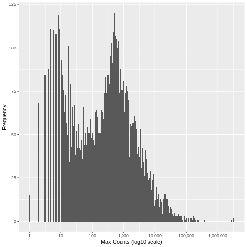

:::::::::::::::::::::::::::::::::::::: questions 

- How do technical artefacts in RNA-Seq data impact machine learning algorithms?
- How can technical artefacts such as low count genes and outlier read counts be effectively removed from RNA-Seq data prior to analysis?

::::::::::::::::::::::::::::::::::::::::::::::::

::::::::::::::::::::::::::::::::::::: objectives

- Describe two important sources of technical noise in RNA-Seq data - genes with very low read counts and genes with influential outlier read counts - and recall why these exist in raw datasets
- Demonstrate how to remove these noise elements from RNA-Seq count data to further improve machine learning readiness using standard R libraries 

::::::::::::::::::::::::::::::::::::::::::::::::


## Technical Artefacts in RNA-Seq Data

Machine learning classification algorithms are highly sensitive to any feature data characteristic, regardless of scale, that may differ between experimental groups, and will exploit these data characteristic differences when training a model. Given this, it is important to make sure that data input into a machine learning model reflects true biological signal, and not technical artefacts or noise that stems from the experimental process used to generate the data. In simple terms, we need to remove things are aren't "real biological information".

There are two important sources of noise inherent in RNA-Seq data that may negatively impact machine learning modelling performance, namely low read counts, and influential outlier read counts.

<br>

## Low read counts

Genes with consistently low read count values across all samples in a dataset may be technical or biological stochastic artefacts such as the detection of a transcript from a gene that is not uniformly active in a heterogeneous cell population or as the result of a transcriptional error. Below some count threshold, genes are unlikely to be representative of true biological differences related to the condition of interest. Filtering out low count genes has been show to increase the classification performance of machine learning classifiers, and to increase the stability of the set of genes selected by a machine learning algorithm in the context of selecting relevant genes.

### Investigating Low Counts

We'll briefly investigate the distribution of read counts in the IBD dataset to illustrate this point. Import the cleaned up counts matrix and sample information text files that we prepared in Episode 4. If you didn't manage to save them, you can download them directly using the following code.


```r
download.file(url = "https://zenodo.org/record/8125141/files/ibd.sample.info.txt",
              destfile = "data/ibd.sample.info.txt")

download.file(url = "https://zenodo.org/record/8125141/files/counts.mat.ibd.txt",
              destfile = "data/counts.mat.ibd.txt")
```

```{.warning}
Warning in download.file(url =
"https://zenodo.org/record/8125141/files/counts.mat.ibd.txt", : downloaded
length 0 != reported length 0
```

```{.warning}
Warning in download.file(url =
"https://zenodo.org/record/8125141/files/counts.mat.ibd.txt", : URL
'https://zenodo.org/record/8125141/files/counts.mat.ibd.txt': Timeout of 60
seconds was reached
```

```{.error}
Error in download.file(url = "https://zenodo.org/record/8125141/files/counts.mat.ibd.txt", : download from 'https://zenodo.org/record/8125141/files/counts.mat.ibd.txt' failed
```

<br>

And now read the files into R...


```r
suppressPackageStartupMessages(library(tidyverse, quietly = TRUE))
```


```r
samp.info.ibd.sel <- read.table(file="./data/ibd.sample.info.txt", sep="\t", header=T, fill=T, check.names=F)

counts.mat.ibd <- read.table(file="./data/counts.mat.ibd.txt", sep='\t', header=T, fill=T, check.names=F)
```

Run the following code to view the histogram giving the frequency of the maximum count for each gene in the sample (plotted on a log10 scale). You'll see in the resulting plot that over 800 genes have no counts for any gene (i.e., maximum = 0), and that there are hundreds of genes where the maximum count for the gene across all samples is below 10. This compares to a median maximum count value of around 250 for the dataset. These low count genes are likely to represent technical noise.

A simple filtering approach is to remove all genes where the maximum read count for that gene over all samples is below a given threshold. The next step is to determine what this threshold should be.


```r
data.frame(max_count = apply(counts.mat.ibd, 1, max, na.rm=TRUE)) %>% 
  ggplot(aes(x = max_count)) + 
    geom_histogram(bins = 200) + 
    xlab("Max Counts (log10 scale)") + 
    ylab("Frequency") +
    scale_x_log10(n.breaks = 6, labels = scales::comma)
```



::::::::::::::::::::::::::::::::::::: challenge 

## Challenge 1:

Based on the distribution of the maximum read counts per gene displayed in the histogram above, where would you estimate the cutoff for low count genes should be set?


:::::::::::::::::::::::: solution 

There is no right answer. However, looking at the histogram, you can see an approximately symmetrical distribution centred around a value between 100 and 1,000 (approximately 250), and a second distirbution of low count genes in the range 1-20. From this, we could estimate that the cut off for low count genes will be approximately in the range 10-20.

:::::::::::::::::::::::::::::::::

::::::::::::::::::::::::::::::::::::::::::::::::


### Read Count Normalisation

In order to be able to compare read counts between samples, we must first adjust ('normalise') the counts to control for differences in sequence depth and sample composition between samples. To achieve this, we run the following code that will normalise the counts matrix using the median-of-ratios method implemented in the R package `DESeq2`. For more information on the rationale for scaling RNA-Seq counts and a comparison of the different metrics used see [RDMBites | RNAseq expression data](https://www.youtube.com/watch?v=tO2H3zuBouw).


```r
# convert the condition variable to a factor as required by DESeq2
samp.info.ibd.sel[c('condition')] <- lapply(samp.info.ibd.sel[c('condition')], factor)

# create DESeq Data Set object from the raw counts, with condition as the factor of interest
dds.ibd <- DESeq2::DESeqDataSetFromMatrix(
    countData = counts.mat.ibd,
    colData = data.frame(samp.info.ibd.sel, row.names = 'sampleID'),
    design = ~ condition)
```

```{.warning}
Warning: replacing previous import 'S4Arrays::makeNindexFromArrayViewport' by
'DelayedArray::makeNindexFromArrayViewport' when loading 'SummarizedExperiment'
```

```{.error}
Error in DESeqDataSet(se, design = design, ignoreRank): NA values are not allowed in the count matrix
```

```r
# calculate the normalised count values using the median-of-ratios method
dds.ibd <- dds.ibd %>% DESeq2::estimateSizeFactors()
```

```{.error}
Error in h(simpleError(msg, call)): error in evaluating the argument 'object' in selecting a method for function 'estimateSizeFactors': object 'dds.ibd' not found
```

```r
# extract the normalised counts
counts.ibd.norm <- DESeq2::counts(dds.ibd, normalized = TRUE)
```

```{.error}
Error in h(simpleError(msg, call)): error in evaluating the argument 'object' in selecting a method for function 'counts': object 'dds.ibd' not found
```

### Setting a Low Counts Threshold

There are a number of methodologies to calculate the appropriate threshold. One widely used approach calculates the threshold that maximises the similarity between the samples, calculating the mean pairwise Jaccard index over all samples in each conditionn of interest, and setting the threshold that maximises this value. The motivation for this measure is that true biological signal will be consistent between samples in the same condition, however low count noise will be randomly distributed. By maximising the similarity between samples in the same class, the threshold is likely to be set above the background noise level. The code for this filter is implemented in the R package `HTSFilter` and the methodology, along with details of alternative approaches, is described in detail by [Rau et al., 2013](10.1093/bioinformatics/btt350).

Calculating the Jaccard index between all pairs of samples in a dataset does not however scale well with the dimensionality of the data. Here we use an alternative approach that achieves a very similar result using the Multiset Jaccard index, which is faster to compute. Don't worry too much about the code, the main point is that we find a filter threshold, and filter out all the genes where the max count value is below the threshold, on the basis that these are likely technical noise. Run the code to plot the Multiset Jaccard Index for a series of values for the filter threshold.


```r
# For the purpose of illustration, and to shorten the run time, we sample 5,000 genes from the counts matrix.

set.seed(10)

counts.ibd.norm.samp <- counts.ibd.norm[sample(nrow(counts.ibd.norm), size = 5000, replace = FALSE),]
```

```{.error}
Error in eval(expr, envir, enclos): object 'counts.ibd.norm' not found
```

```r
# create vector of the class labels
condition <- samp.info.ibd.sel$condition

# create a sequence of thresholds to test
t.seq <- seq(1, 25, by = 1)

# Function to calculate the Multiset Jaccard Index' over all samples
Jaccard = function(mat){
  row.sums = rowSums(mat)
  inter = sum(row.sums == ncol(mat))
  union = sum(row.sums > 0)
  return(inter/union)
}

# Calculate vector of the minimum Multiset Jaccard Index over the three classes, for each value of t

ms.jac = sapply(t.seq, function(t){
  filt.counts = counts.ibd.norm.samp >=t
  group.jac = sapply(unique(condition), function(cond){
    Jaccard(filt.counts[,condition==cond])
  })
  return(min(group.jac))
})
```

```{.error}
Error in FUN(X[[i]], ...): object 'counts.ibd.norm.samp' not found
```

```r
# plot the threshold value against the value of the Multiset Jaccard index to visualise

ggplot(data=data.frame(t = t.seq, jacc = ms.jac)) +
            geom_line(aes(x=t, y=jacc)) +
            geom_hline(yintercept = max(ms.jac), lty=2,col='gray') +
            geom_point(aes(x=which.max(ms.jac), y=max(ms.jac)), col="red", cex=6, pch=1) +
            xlab("Low Count Threshold") + 
            ylab("Multiset Jaccard Index")
```

```{.error}
Error in eval(expr, envir, enclos): object 'ms.jac' not found
```

::::::::::::::::::::::::::::::::::::: challenge 

## Challenge 2:

What value should we use for the low counts threshold?

:::::::::::::::::::::::: solution 

The threshold value is given by the following code, which should return a value close to 10 for this dataset.


```r
(t.hold <- which.max(ms.jac))
```

```{.error}
Error in eval(expr, envir, enclos): object 'ms.jac' not found
```

:::::::::::::::::::::::::::::::::

::::::::::::::::::::::::::::::::::::::::::::::::


### Filtering Low Counts

Having determined a threshold, we then filter the raw counts matrix on the rows (genes) that meet the threshold criterion based on the normalised counts. As you can see, around 4,000 genes are removed from the dataset, which is approximately 20% of the genes. These genes are unlikely to contain biologically meaningful information but they might easily bias a machine learning classifier.


```r
counts.mat.ibd.filtered <- counts.mat.ibd[which(apply(counts.ibd.norm, 1, function(x){sum(x > t.hold) >= 1})),]
```

```{.error}
Error in eval(expr, envir, enclos): object 'counts.ibd.norm' not found
```

```r
sprintf("Genes filtered: %s; Genes remaining: %s", nrow(counts.mat.ibd)-nrow(counts.mat.ibd.filtered), nrow(counts.mat.ibd.filtered))
```

```{.error}
Error in eval(expr, envir, enclos): object 'counts.mat.ibd.filtered' not found
```


## Outlier Reading Counts

A second source of technical noise is outlier read counts. Relatively high read counts occurring in only
a very small number of samples relative to the size of each patient group are unlikely to be representative
of the general population and a result of biological heterogeneity and technical effects. These very large count values may bias machine learning algorithms if they help to discriminate between examples in a training set, leading to model overfitting. Such influential outliers may be the result of natural variation between individuals or they may have been introduced during sample preparation. cDNA libraries require PCR amplification prior to sequencing to achieve sufficient sequence depth. This clonal amplification by PCR is stochastic in nature; different fragments may be amplified with different probabilities. This leaves the possibility of outlier read counts having resulted from bias introduced by amplification, rather than biological differences between samples. The presence of these outlier read counts for a particular gene may therefore inflate the observed association between a particular gene and the condition of interest.

Run the following code to view the top 10 values of read counts in the raw counts matrix. Compare this with the histogram above, and the mean read count. The largest read count values range from 2MM to over 3MM counts for a gene in a particular sample. These require investigation!


```r
tail(sort(as.matrix(counts.mat.ibd)),10)
```

```{.output}
 [1] 2037946 2038514 2043983 2133125 2238093 2269033 2341479 2683585 3188911
[10] 3191428
```

```r
sprintf("The mean read count value: %f", mean(as.matrix(counts.mat.ibd)))
```

```{.output}
[1] "The mean read count value: NA"
```

## Outlier Read Count Filtering

As with low counts, multiple methods exist to identify influential outlier read counts. A summary is provided by [Parkinson et al.](https://doi.org/10.3389/fgene.2023.1158352). Here we adopt an approach that is built into the R package `DESeq2` that identifies potential influential outiers based on their Cooks distance.

Run the following code to create DESeq Data Set object from the filtered raw counts matrix, with condition as the experimental factor of interest.


```r
dds.ibd.filt <- DESeq2::DESeqDataSetFromMatrix(
    countData = counts.mat.ibd.filtered,
    colData = data.frame(samp.info.ibd.sel, row.names = 'sampleID'),
    design = ~ condition)
```

```{.error}
Error in h(simpleError(msg, call)): error in evaluating the argument 'x' in selecting a method for function 'ncol': object 'counts.mat.ibd.filtered' not found
```

Run `DESeq2` differential expression analysis, which automatically calculates the Cook's distances for every read count. This may take a few minutes to run.


```r
deseq.ibd <-  DESeq2::DESeq(dds.ibd.filt)
```

```{.error}
Error in eval(expr, envir, enclos): object 'dds.ibd.filt' not found
```

```r
cooks.mat <- SummarizedExperiment::assays(deseq.ibd)[["cooks"]]
```

```{.error}
Error in h(simpleError(msg, call)): error in evaluating the argument 'x' in selecting a method for function 'assays': object 'deseq.ibd' not found
```

We now calculate the cooks outlier threshold by computing the expected F-distribution for the number of samples in the dataset.


```r
cooks.quantile <- 0.95
m <- ncol(deseq.ibd)     # number of samples
```

```{.error}
Error in eval(expr, envir, enclos): object 'deseq.ibd' not found
```

```r
p <- 3                   # number of model parameters (in the three condition case)

h.threshold <- stats::qf(cooks.quantile, p, m - p)
```

```{.error}
Error in eval(expr, envir, enclos): object 'm' not found
```

Filter the counts matrix to eliminate all genes where the cooks distance is over the outlier threshold. Here you can see that a further ~1,800 genes are filtered out based on having outlier read count values for at least one sample.


```r
counts.mat.ibd.ol.filtered <-  counts.mat.ibd.filtered[which(apply(cooks.mat, 1, function(x){(max(x) < h.threshold) >= 1})),]
```

```{.error}
Error in eval(expr, envir, enclos): object 'counts.mat.ibd.filtered' not found
```

```r
sprintf("Genes filtered: %s; Genes remaining: %s", nrow(counts.mat.ibd.filtered)-nrow(counts.mat.ibd.ol.filtered), nrow(counts.mat.ibd.ol.filtered))
```

```{.error}
Error in eval(expr, envir, enclos): object 'counts.mat.ibd.filtered' not found
```


Run the same plot as above, and we can see that the genes with very low maximum counts over all samples have been removed. Note that here we are looking at the raw unnormalised counts, so not all maximum counts are below 11, as the filter was applied to the normailsed counts.


```r
data.frame(max_count = apply(counts.mat.ibd.ol.filtered, 1, max, na.rm=TRUE)) %>% 
  ggplot(aes(x = max_count)) + 
    geom_histogram(bins = 200) + 
    xlab("Max Counts (log10 scale)") + 
    ylab("Frequency") +
    scale_x_log10(n.breaks = 6, labels = scales::comma)
```

```{.error}
Error in eval(expr, envir, enclos): object 'counts.mat.ibd.ol.filtered' not found
```

<br>

Now save the output as a file that we will use in the next episode.

```r

write.table(counts.mat.ibd.ol.filtered, file="./data/counts.mat.ibd.ol.filtered.txt", sep = '\t', quote = FALSE, row.names = TRUE)

```

::::::::::::::::::::::::::::::::::::: keypoints 

- RNA-Seq read counts contain two main sources of technical 'noise' that are unlikely to represent true biological information, and may be artefacts from experimental processes required to generate the data: Low read counts and influential outlier read counts.
- Filtering out low count and influential outlier genes removes potentially biasing variables without negatively impacting the performance of downstream machine learning analysis. Gene filtering is therefore an important step in preparing an RNA-Seq dataset to be machine learning ready.
- Multiple approaches exist to identify the specific genes with uninformative low count and influential outlier read counts in RNA-Seq data, however they all aim to find the boundary between true biological signal and technical and biological artefacts.


:::::::::::::::::::::::::::::::::::::
