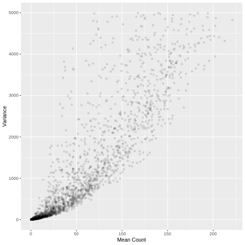
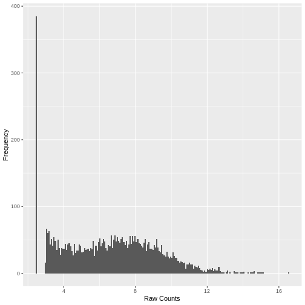
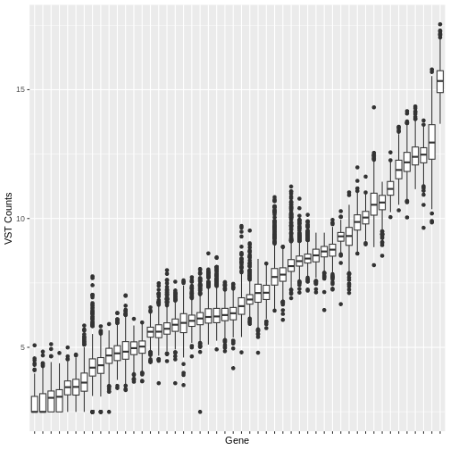

:::::::::::::::::::::::::::::::::::::: questions 

- Do I need to transform or rescale RNA-Seq data before inputting into a machine learning algorithm?
- What are the most appropriate transformations and how do these depend on the particular machine learning algorithm being employed?

::::::::::::::::::::::::::::::::::::::::::::::::

::::::::::::::::::::::::::::::::::::: objectives

- Describe the main characteristics of the distribution of RNA-Seq count data and how this impacts the performance of machine learning algorithms
- Recall the main types of data transformation commonly applied to RNA-Seq count data to account for skewedness and heteroskedasticity
- Demonstrate how to apply these transformations in R
- Recall the two types of data rescaling commonly applied prior to machine learning analysis, and which is most appropriate for a range of common algorithms

::::::::::::::::::::::::::::::::::::::::::::::::

## RNA-Seq Counts Data: A Skewed Distribution

RNA-Seq count data has an approximately negative binomial distribution. Even after filtering out low count genes, the distribution of count data is heavily skewed towards low counts. Counts data is also heteroskedastic, which means the variance depends on the mean. These two properties negatively impact the performance of some machine learning models, in particular Regression based models. Let's examine these properties in our dataset. 

To begin, import the filtered counts matrix and sample information text files that we prepared in Episodes 4 and 5. If you didn't manage to save it, you can download it directly with the following code.

```r

download.file(url = "https://zenodo.org/record/8125141/files/ibd.sample.info.txt",
              destfile = "data/ibd.sample.info.txt")

download.file(url = "https://zenodo.org/record/8125141/files/counts.mat.ibd.ol.filtered.txt",
              destfile = "data/counts.mat.ibd.ol.filtered.txt")

```

And now read the files into R...


```r
# suppressPackageStartupMessages(library(dplyr, quietly = TRUE))
# suppressPackageStartupMessages(library(ggplot2, quietly = TRUE))
# suppressPackageStartupMessages(library(tibble, quietly = TRUE))
```


```r
samp.info.ibd.sel <- read.table(file="./data/ibd.sample.info.txt", sep="\t", header=T, fill=T, check.names=F)

counts.mat.ibd.ol.filtered <- read.table(file="./data/counts.mat.ibd.ol.filtered.txt", sep='\t', header=T, fill=T, check.names=F)
```

A simple histogram of the raw counts data illustrates the skewed nature of the distribution. Here we plot a random sample of just 5,000 counts to illustrate the point.


```r
set.seed(seed = 30)

`%>%` <- magrittr::`%>%`
 
counts.mat.ibd.ol.filtered %>%               
  tibble::rownames_to_column("geneID")  %>%      
  reshape2::melt(id.vars = 'geneID', value.name='count', variable.name=c('sampleID')) %>% 
  .[sample(nrow(.), size = 5000, replace = FALSE),] %>% 
  ggplot2::ggplot(ggplot2::aes(x = count)) + 
    ggplot2::geom_histogram(bins = 200) + 
    ggplot2::xlab("Raw Counts") + 
    ggplot2::ylab("Frequency")
```


A plot of the mean count against the variance of the counts for a random sample of 5,000 genes (to reduce compute time) illustrates the clear mean variance relationship in the data. The variance is increasing as the mean count increases.


```r
counts.mat.ibd.ol.filtered %>%               
  .[sample(nrow(.), size = 5000, replace = FALSE),] %>% 
  data.frame(row.mean = apply(., 1, mean),
           row.var = apply(., 1, var)) %>%
  dplyr::filter(row.var < 5000) %>% 
  ggplot2::ggplot(ggplot2::aes(x=row.mean, y=(row.var))) +
    ggplot2::geom_point(alpha=0.1) +
    ggplot2::xlab("Mean Count") +
    ggplot2::ylab("Variance")
```



## Variance Stabilising and rlog Transformation

A number of standard transformations exist to change the distribution of RNA-Seq counts to reduce the mean variance relationship, and make the distribution more 'normal' (Gaussian). Two such transformations are the `variance stabilising transformation (vst)` and the `rlog` transformation available in the `DESeq2` R package. Both transformations take raw counts data as input, and perform the normalisation step before the transformation.

The `vst` transformation is faster to run and more suitable for datasets with a large sample size. Let's conduct the `vst` transformation on our filtered counts data. This may take a few minutes to run on our dataset.


```r
# convert the condition variable to a factor as required by DESeq2
samp.info.ibd.sel[c('condition')] <- lapply(samp.info.ibd.sel[c('condition')], factor)

# create DESeq Data Set object from the raw counts, with condition as the factor of interest
dds.ibd.filt.ol <- DESeq2::DESeqDataSetFromMatrix(
  countData = as.matrix(counts.mat.ibd.ol.filtered),
  colData = data.frame(samp.info.ibd.sel, row.names = 'sampleID'),
  design = ~ condition)                    
```

```{.warning}
Warning: replacing previous import 'S4Arrays::makeNindexFromArrayViewport' by
'DelayedArray::makeNindexFromArrayViewport' when loading 'SummarizedExperiment'
```

```r
# calculate the vst count values and extract the counts matrix using the assay() function
counts.mat.ibd.vst <- DESeq2::varianceStabilizingTransformation(dds.ibd.filt.ol, blind=FALSE) %>% 
  SummarizedExperiment::assay()
```

Plotting the data again, we can see the difference in the distribution of the data following transformation. Although there is still a large number of count values equal to zero, the distribution of vst transformed counts is far less heavily skewed than the original. The dependence of the variance on the mean has essentially been eliminated.


```r
set.seed(seed = 30)
 
counts.mat.ibd.vst %>% 
  as.data.frame() %>% 
  tibble::rownames_to_column("geneID")  %>%      
  reshape2::melt(id.vars = 'geneID', value.name='count', variable.name=c('sampleID')) %>% 
  .[sample(nrow(.), size = 5000, replace = FALSE),] %>% 
  ggplot2::ggplot(ggplot2::aes(x = count)) + 
    ggplot2::geom_histogram(bins = 200) + 
    ggplot2::xlab("Raw Counts") + 
    ggplot2::ylab("Frequency")
```




```r
counts.mat.ibd.vst %>% 
  as.data.frame() %>%               
  .[sample(nrow(.), size = 5000, replace = FALSE),] %>% 
  data.frame(row.mean = apply(., 1, mean),
           row.var = apply(., 1, var)) %>%
  dplyr::filter(row.var < 2.5) %>% 
  ggplot2::ggplot(ggplot2::aes(x=row.mean, y=(row.var))) +
    ggplot2::geom_point(alpha=0.1) +
    ggplot2::xlab("Mean Count") +
    ggplot2::ylab("Variance")
```


## Rescaling transformed counts data: standardisation and Min-Max Scaling

Many machine learning algorithms are sensitive to the scale of the data. Even after having 'normalised' RNA-Seq counts data to account for differences in sequence depth and sample composition, and having performed a variance stabilising transformation or rlog transformation to reduce the skewedness and mean-variance relationship, individual genes (variables) will still be on very different scales. The box plot below illustrates this for a small sample of 50 genes from our dataset, with median vst counts ranging from close to zero, to greater than 10. 


```r
counts.mat.ibd.vst %>% 
  as.data.frame() %>% 
  tibble::rownames_to_column("geneID")  %>%  
  .[sample(nrow(.), size = 50, replace = FALSE),] %>% head(50) %>% 
  reshape2::melt(id.vars = 'geneID', value.name='count', variable.name=c('sampleID')) %>% 
  ggplot2::ggplot(ggplot2::aes(x = reorder(geneID, count, median), y = count)) + 
    ggplot2::geom_boxplot() + 
    ggplot2::xlab("Gene") + 
    ggplot2::ylab("VST Counts") +
  ggplot2::theme(axis.text.x = ggplot2::element_blank())
```



In some cases, further scaling of variables will be necessary to put each gene on a similar scale before inputting into a machine learning algorithm. The table below outlines the scenarios where variable scaling will improve the performance of downstream machine learning analysis.

Scenario | Rationale for Scaling
--- | ---------
**Distance-Based Algorithms** |  Algorithms that use the Euclidian distance between points to determine the similarity between points require all features to be on the same scale.  Without scaling, models will be biased towards features on a larger scale. Examples include clustering techniques: **K-Nearest Neighbours**, **K-means clustering**, **Principal Component Analysis**, and **Support Vector Machines**
**Gradient Descent Optimised Algorithms** |  Algorithms that are optimised using a gradient descent algorithm apply the same learning rate to each variable. Different variable scales will result in very different step sizes across variables, compromising the algorithm's ability to find a minimum. **Linear Regression**, **Logistic Regression** and **Neural Networks** are all optimised using gradient descent algorithms.
**Loss Functions with Regularisation Penalties** |  Machine learning models incorporating a penalty term in the cost function to regularise the model, for example the **LASSO**, use magnitude of variable coefficients in the penalty term. Without scaling, the penalisation will be biased towards variables on a larger scale.

On the other hand, there are algorithms that are insensitive to scale where scaling is not necessary. These include tree based models such as **Random Forest**, **XGBoost**, **Linear Discriminant Analysis** and **Naive Bayes**.

<br>

Two widely used rescaling approaches are standardisation (also known as z-scoring), where the distribution of values in every variable is centred around a mean of zero with unit standard deviation, and min-max scaling (confusingly, also known as normalisation) where the values are rescaled to be within the range [0, 1]. In many cases either may be appropriate. The table below gives a few guidelines on when one may be more appropriate than the other.


Scaling Method | Formula | When more appropriate
--- | -- | -----------
**Standardisation** | $\frac{(x - \mu)}{\sigma}$   | - Distribution of the variable data is Gaussian or unknown <br> - Data contains outlier values that would cause the remaining data to be compressed into a very small range if Min-Max scaling is used <br> - The algorithm being used assumes the data has a Gaussian distribution, e.g. **linear regression**
**Min-Max Scaling** | $\frac{(x - x_{min})}{x_{max} - x_{min}}$ | - The distribution of the variable data known not to be Gaussian <br> - The algorithm being used does not make any assumptions about the distribution fo the the data, e.g. **neural networks**, **k-nearest neighbours**

The above is based on a more detailed explanation available at [Analytics Vidhya](https://www.analyticsvidhya.com/blog/2020/04/feature-scaling-machine-learning-normalization-standardization/).

::::::::::::::::::::::::::::::::::::: challenge 

## Challenge 1:

Test your machine learning knowledge. For each of the following commonly used supervised and unsupervised machine learning algorithms, how would you scale your data, assuming that there were no significant outliers? Would you standardise it, min-max scale it, or leave it unscaled?

* Linear Regression
* Linear Descriminant Analysis
* Logistic Regression
* Support Vector Machines
* Naive Bayes
* K-Nearest-Neighbour
* Decision Trees
* Random Forest
* XGBoost
* Neural Network based models
* Principal Component Analysis
* K-means clustering

:::::::::::::::::::::::: solution 

Model                           | Standardise | Min-Max   | Unscaled | Rationale
-----                           | --          | --        | --       | ----------------
**Linear Regression**           | x           |           |          | May be optimised by gradient descent; may be regularised with penalty
**Linear Descriminant Analysis**|             |           | x        | Insensitive to scale
**Logistic Regression**         | x           |           |          | Optimised by gradient descent; may be regularised with penalty
**Support Vector Machines**     | x           |           |          | Distance based; may be optimised by gradient descent; may be regularised with penalty 
**Naive Bayes**                 |             |           | x        | Insensitive to scale, probability (not distance) based
**K-Nearest-Neighbour**         |             | x         |          | Distance based; no assumption about data distribution
**Random Forest**               |             |           | x        | Insensitive to scale, variables treated individually
**XGBoost**                     |             |           | x        | Insensitive to scale, variables treated individually
**Neural Network based models** |             | x         |          | Optimised by gradient descent; no assumption about data distribution
**Principal Component Analysis**| x           |           |          | Distance based; may be optimised by gradient descent 
**K-means clustering**          | x           |           |          | Distance based


:::::::::::::::::::::::::::::::::

::::::::::::::::::::::::::::::::::::: 

::::::::::::::::::::::::::::::::::::: keypoints 

* RNA-Seq read count data is heavily skewed with a large percentage of zero values. The distribution is heteroskedastic, meaning the variance depends on the mean.
* Standard transformations such as the variance stabilising transformation and rlog transformation are designed to make the distribution of RNA-Seq data more Gaussian and homoskedastic, which will improve the performance of some machine learning approaches. These transformations are improvements to a simple log2 transformation in particular for low count values.
* Many machine learning algorithms require predictor variables to be on the same scale. Even after vst or rlog transformation, genes in an RNA-Seq dataset will be on very different scales.
* Standardisation (z-score) and min-max scaling are two common techniques to rescale variables.
* Data should be scaled before use with machine learning models that use distance based measures, that include regularisation penalties that utilise absolute values of model coefficients and for models that are optimised via gradient descent. Naive Bayes and tree based models are insensitive to scaling and variables may be left unscaled.

:::::::::::::::::::::::::::::::::::::
