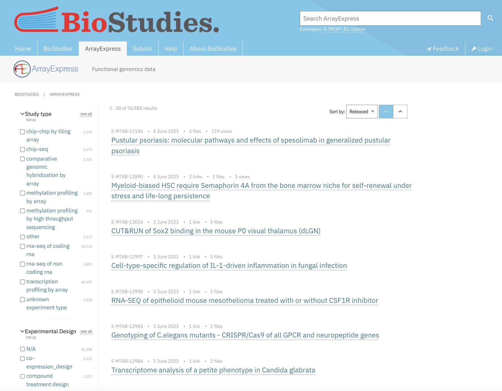

:::::::::::::::::::::::::::::::::::::: questions 

- What format are processed RNA-Seq dataset store on Array Express?
- Which files do I need to download?
- How do I search for a dataset that meets my requirements on Array Express?
- How do I download and import the data into R?

::::::::::::::::::::::::::::::::::::::::::::::::

::::::::::::::::::::::::::::::::::::: objectives

- Explain the expected data and file formats for processed RNA-Seq datasets on ArrayExpress
- Demonstrate ability to correctly identify the subset of files required to create a dataset for a simple supervised machine learning task (e.g., binary classification)
- Demonstrate ability to download and save processed RNA-Seq data files from ArrayExpress suitable for a simple supervised machine learning task (e.g., binary classification)

::::::::::::::::::::::::::::::::::::::::::::::::


## ArrayExpress File Formats

Array Express data sets comprise of three important files. Each experiment is stored in [MAGE-TAB format](https://www.ebi.ac.uk/biostudies/misc/MAGE-TABv1.1_2011_07_28.pdf). There are four key files: 

1. **Sample and Data Relationship Format (SDRF)**. The tab-delimited SDRF file contains information about the samples, such as phenotypical information, and factors that may be of interest in a classification task. This file may also contain information about the relationships between the samples, and details of the file names of the raw data fastq for each sample.
2. **Investigation Description Format (IDF)**. The tab-delimited IDF file contains top level information about the experiment including title, description, submitter contact details and protocols.
3. **Raw data files**. These are typically sequence data stored in fastq format. In some data sets, the term raw data may refer to raw counts data, meaning RNA-Seq counts that have not undergone further processing.
4. **Processed data files**. These may refer to raw counts data (i.e. data processed to counts from fastq) or counts data that has undergone further processing such as conversion to FPKM or TPM values.

Raw or processed counts data may be provided as a separate txt files for each sample, or as a matrix of all samples in .csv, .tsv and other formats.


## Searching for a Dataset on ArrayExpress

We'll use ArrayExpress to select a RNA-Seq dataset with a case control design, suitable for constructing a machine learning classification model. Machine learning based analyses generally perform better the larger the sample size, and may perform very poorly and give misleading results with insufficient samples, so we'll look for a datasets with a relatively large number of samples.

Let's begin on the [ArrayExpress home page](https://www.ebi.ac.uk/biostudies/arrayexpress/studies). 

<br>

{alt='Screen Shot of Array Express Collection Tab'}

<br>

We'll apply the following filters to refine the results set. Leave all other filters as the default with no selection:

<br>

Filter                   | Selection
------------------------ | ---------------------
Study type               | rna-seq of coding rna
Organism                 | homo sapiens
Technology               | sequencing assay
Assay by Molecule        | rna assay
Processed Data Available | check

<br>

Now use the sort to sort the results by "Samples", in descending order. The results should look similar to this:

<br>

{alt='Screen Shot of Array Express Collection Tab Filtered Results'}

## Illustrative Dataset: IBD Dataset

In the search results displayed above, the top ranked dataset is E-MTAB-11349, Whole blood expression profiling of patients with inflammatory bowel diseases in the IBD-Character cohort. We'll call it the [IBD dataset](https://www.ebi.ac.uk/biostudies/arrayexpress/studies/E-MTAB-11349).

The IBD dataset (E-MTAB-11349) comprises human samples of patients with inflammatory bowel diseases and controls. Let's look at some of the basic information on this dataset:

<br>

Data Field              | Values
----------------------- | ---------------------
Sample count            | 590
Experimental Design     | case control design
Experimental factors    | Normal, Ulcerative colitis, Crohn's disease

<br>

The 'Protocols' section explains the main steps in the generation of the data. The nucleic acid sequencing protocol gives details of the sequencing platform used to generate the raw fastq data, and the version of the human genome used in the alignment step to generate the count data. The normalization data transformation protocol gives the tools used to normalise raw counts data for sequence depth and sample composition, in this case normalisation is conducted using the R package DESeq2.

The dataset provides two alternative sets of processed data, a matrix of raw counts, and a matrix of processed counts that have been normalised using DESeq2, and filtered to only include transcripts with a mean raw expression read count > 10.

## Downloading and Reading into R

Let's download the SDRF file and the raw counts matrix - these are the two files that contain the information we will need to build a machine learning classification model. In the data files box to the right hand side, check three of the three files
E-MTAB-11349.sdrf.txt, E-MTAB-11349.idf.txt and ArrayExpress-raw.csv, and save in a folder called data in the working directory for your R workbook.

<br>

### Raw counts matrix

Let's read in the raw counts data and check the dimensions of the matrix to confirm we have the expected number of samples and transcript IDs.

```{r}
raw.counts.ibd <- read.table(file="data/E-MTAB-11349.counts.matrix.csv",
                             sep=",",
                             header=T,
                             fill=T,
                             check.names=F)

writeLines(sprintf("%i %s", c(dim(raw.counts.ibd)[1], dim(raw.counts.ibd)[2]), c("rows corresponding to transcript IDs", "columns corresponding to samples")))

```


::::::::::::::::::::::::::::::::::::: challenge 

## Challenge 1:

View a small subset of the data, (e.g. first ten rows and 8 columns) to see how the samples are labelled and how the sample and transcript IDs are formatted.

:::::::::::::::::::::::: solution 

```{r}

raw.counts.ibd[1:10,1:8]

```
:::::::::::::::::::::::::::::::::

::::::::::::::::::::::::::::::::::::::::::::::::


### SDRF File

Read the sdrf file into R and check the dimensions of the file.

```{r}
# read in the sdrf file

samp.info.ibd <- read.table(file="data/E-MTAB-11349.sdrf.txt", sep="\t", header=T, fill=T, check.names=F)

sprintf("There are %i rows, corresponding to the samples", dim(samp.info.ibd)[1])
sprintf("There are %i columns, corresponding to the available variables for each sample", dim(samp.info.ibd)[2])

```

Examine the column names, which describe the variables available for each samples in the data.

```{r}

colnames(samp.info.ibd)

```

::::::::::::::::::::::::::::::::::::: keypoints 

- ArrayExpress stores two standard files with information about each experiment: 1. Sample and Data Relationship Format (SDRF) and 2. Investigation Description Format (IDF).
- ArrayExpress provides raw and processed data for RNA-Seq datasets, typically stored as csv, tsv, or txt files.
- The basic filers on the ArrayExpress website allow you to select and download a dataset that meets your needs

::::::::::::::::::::::::::::::::::::::::::::::::

